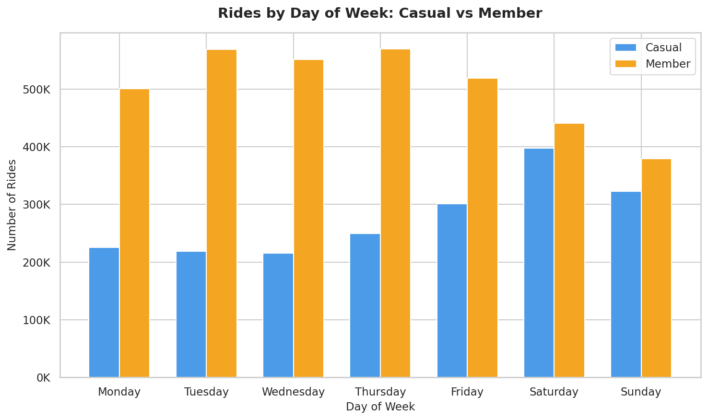
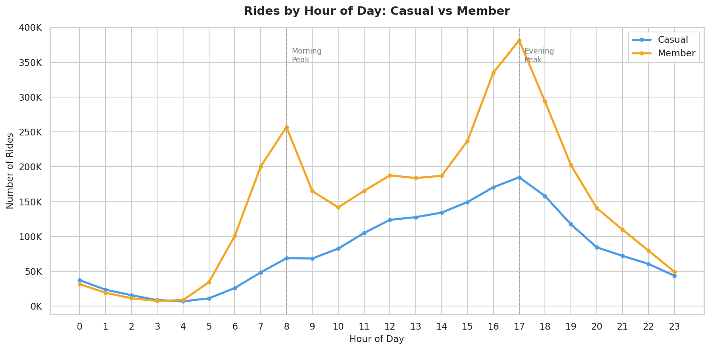
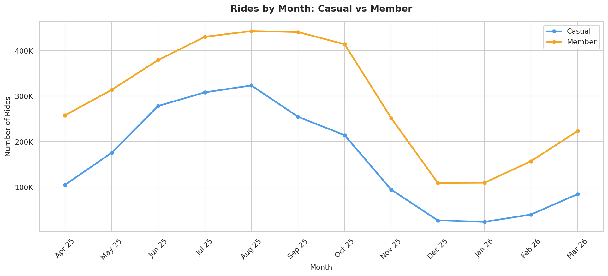

# Case Study: Cyclistic Bike-Share Analysis
### How do annual members and casual riders use Cyclistic bikes differently?

---

## Background

Cyclistic is a bike-share company based in Chicago that launched in 2016. Since then, the program has grown to a fleet of 5,824 bicycles, all geotracked and locked into a network of 692 docking stations across the city. Bikes can be unlocked from one station and returned to any other station at any time, offering riders maximum flexibility.

Cyclistic sets itself apart by offering not just traditional bikes, but also reclining bikes, hand tricycles, and cargo bikes, making the service more inclusive to people with disabilities and riders who can't use a standard two-wheeled bike. About 8% of riders use these assistive options. While the majority of users ride for leisure, approximately 30% use Cyclistic bikes for their daily commute.

Cyclistic's pricing structure includes three options: single-ride passes, full-day passes, and annual memberships. Customers who purchase single-ride or full-day passes are referred to as **casual riders**, while those who purchase annual memberships are called **Cyclistic members**.

---

## My Role

As a junior data analyst on Cyclistic's marketing analytics team, I was tasked with analyzing how different customer segments interact with the bike-share service. This analysis supports the director of marketing's belief that the company's future growth depends on increasing the number of annual members.

---

## Business Task

This analysis focuses on the first of three strategic questions guiding Cyclistic's future marketing program:

*How do annual members and casual riders use Cyclistic bikes differently?*

Understanding the behavioral differences between these two segments is the foundation for designing a data-driven marketing strategy that effectively converts casual riders into annual members. The insights from this analysis will be presented to Cyclistic's director of marketing and reviewed by the executive team for program approval.

Deliverables from this analysis include:
- A clear statement of the business task
- A description of all data sources used
- Documentation of data cleaning and manipulation
- A summary of analysis findings
- Supporting visualizations and key findings
- Top three marketing recommendations

---

## Data Sources

This analysis uses 12 months of Cyclistic historical trip data spanning from April 2025 to March 2026, sourced from Motivate International Inc. under a public license. The dataset consists of 12 CSV files containing a total of 5,620,544 ride records before cleaning.

Each file contains 13 fields, including ride ID, bike type, start and end timestamps, station names and IDs, geographic coordinates, and rider membership type.

**Data Limitations**

Due to data privacy regulations, personally identifiable information is not available in this dataset. This means it is not possible to determine whether casual riders are repeat users, where they live, or whether they have previously purchased multiple single-ride passes. As a result, this analysis focuses exclusively on behavioral patterns observable from trip-level data.

---

## Data Cleaning

All data processing and cleaning was performed using Python (Pandas) in Google Colab. The following steps were taken to ensure data quality before analysis:

The 12 monthly CSV files were merged into a single dataframe resulting in 5,620,544 records. Two additional columns were created: `ride_length`, calculated as the difference between `ended_at` and `started_at`, and `day_of_week`, extracted from the `started_at` timestamp where 1 = Monday and 7 = Sunday.

The following records were removed from the dataset:

- 29 rides with zero or negative ride duration, likely due to system errors
- 5,784 rides with missing end coordinates, which would affect geographic accuracy
- 151,382 rides with duration under 1 minute, likely representing false starts or user errors
- 11 records from an incomplete March 2025 dataset

After cleaning, the final dataset contains **5,463,338 records**, representing approximately 97% of the original data.

---

## Analysis & Key Findings

Analysis was conducted across four dimensions: ride duration, day-of-week patterns, time-of-day patterns, and seasonal trends. The findings consistently point to a fundamental difference in how casual riders and members use Cyclistic bikes.

**1. Casual Riders Take Longer Rides**

On average, casual riders take trips lasting 19.9 minutes, compared to 12.3 minutes for members, a difference of 62%. This suggests that casual riders tend to use bikes for leisure or exploration, while members use them for shorter, more purposeful trips.

.png)

**2. Members Ride More on Weekdays, Casuals on Weekends**

Members show consistently higher ride volume from Monday through Friday, peaking mid-week. Casual riders are most active on Saturdays and Sundays. This pattern strongly indicates that members primarily use Cyclistic for commuting, while casual riders use it for weekend recreation.

**3. Members Follow a Commuter Schedule**

When looking at rides by hour of day, members show two sharp peaks: one at 8 AM and another at 5 PM, which align precisely with typical work commute hours. Casual riders show no morning peak and instead gradually build toward an afternoon peak around 3-5 PM, consistent with leisure usage.

**4. Ridership Peaks in Summer for Both Segments**

Both casual riders and members peak in August, with members reaching 443K rides and casual riders 323K rides. Both segments decline sharply in winter, but casual riders experience a steeper proportional drop of 93% compared to 75% for members, suggesting that leisure-driven trips are more weather-dependent than commute-driven ones.

---

## Conclusion

To answer the key business question: **How do annual members and casual riders use Cyclistic bikes differently?**

- **Ride Duration:** Casual riders ride nearly 2x longer than members (19.9 vs 12.3 minutes)
- **Day of Week:** Casual riders are most active on weekends, members on weekdays
- **Time of Day:** Members follow a clear commuter pattern, casual riders do not
- **Seasonality:** Casual riders experience a steeper proportional decline in winter than members

Taken together, these findings paint a clear picture: casual riders use Cyclistic as a leisure activity, while members rely on it as a daily commuting tool. This distinction is the foundation for the marketing recommendations below.

---

## Recommendations

Based on the analysis, the following three marketing strategies are recommended to convert casual riders into annual members:

**1. Target Casual Riders with Weekend-to-Weekday Conversion Campaigns**

Since casual riders are most active on weekends, Cyclistic should use this touchpoint to introduce the value of annual membership for everyday use. In-app notifications or digital ads served during weekend rides can highlight how a membership pays off for commuters, emphasizing cost savings for riders who use the service five days a week versus occasional single-ride purchases.

**2. Launch a Summer Acquisition Campaign**

Casual ridership peaks between June and August, representing the highest concentration of potential converts. A time-limited membership promotion during this window, such as a discounted first-year membership or a free trial period, would capture casual riders at their highest engagement point before winter reduces their activity.

**3. Promote the Commuter Use Case to Leisure Riders**

Many casual riders may not have considered using Cyclistic for their daily commute. A targeted digital campaign showing the time and cost benefits of using Cyclistic for commuting, paired with messaging around the predictability of a flat annual fee versus accumulating single-ride costs, could shift how casual riders perceive the value of membership.

---

## Tools Used
- Python (Pandas, Matplotlib, Seaborn) - For Data Cleaning & Exploratory Data Analysis
- Google Colab - For Python environment and cloud-based processing
- Kaggle Notebook: [View on Kaggle](https://www.kaggle.com/code/alexanderrian/cyclistic-bike-share-riding-behavior-analysis)
- Google Looker Studio: [View Interactive Dashboard](https://lookerstudio.google.com/reporting/43512bf1-3bfe-485e-abdb-b8e013d5400c)

---

## Dataset
- **Source:** Motivate International Inc. via Google Data Analytics Professional Certificate (Cyclistic Case Study)
- **Scope:** 5,463,338 rides | April 2025 - March 2026
- **Features:** Ride ID, Bike Type, Start & End Timestamps, Start & End Station Names, Start & End Coordinates, Membership Type

---

*Author: Alexander Rian*
